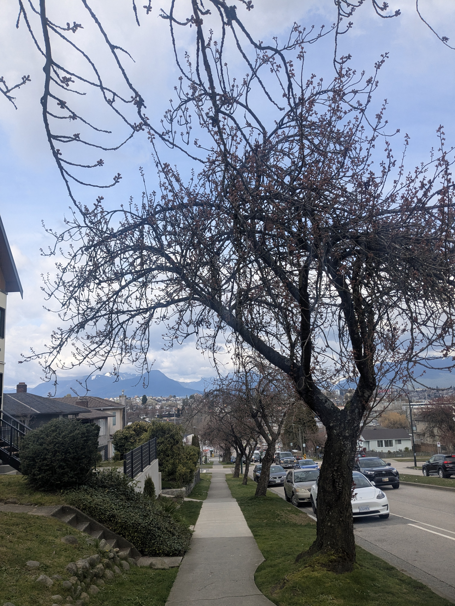
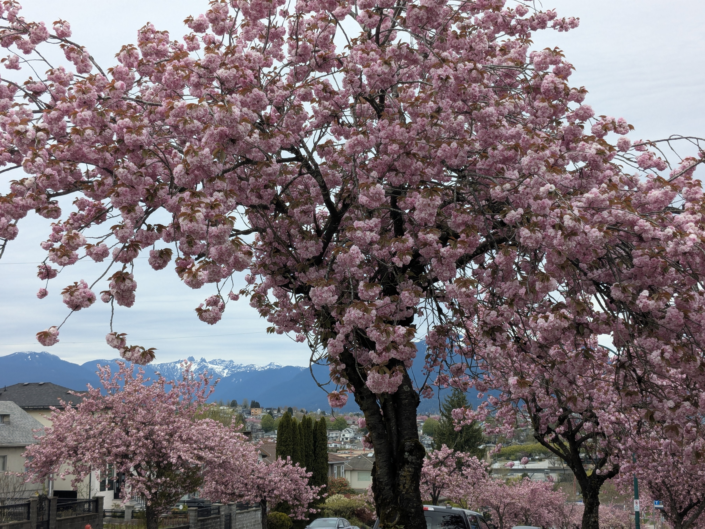
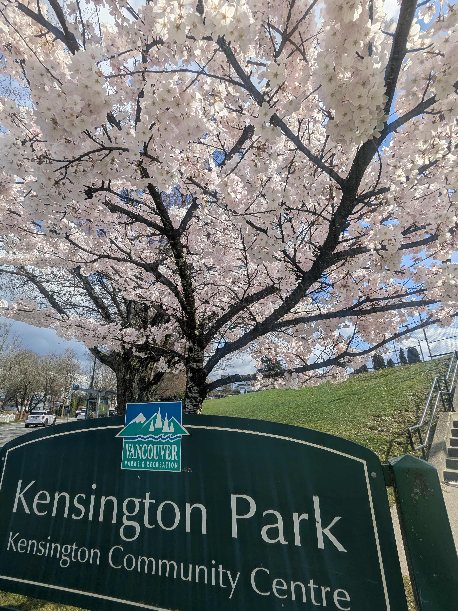

```{r}
#| label: setup
#| echo: false
#| eval: true
library(sf)
library(dplyr)
library(stringr)
library(tidyr)
library(mapgl)
library(sfnetworks)
library(igraph)
library(spopt)
library(ggplot2)
library(purrr)
```

## Motivation {background-color="#ffb7c5"}

- Every spring Vancouver gets buried in cherry blossoms
- The [Vancouver Cherry Blossom Festival](https://vcbf.ca/) runs ~March 27 – April 17
- But **which streets** are actually worth visiting?
- And could you see the best of them in a single run?


## The Goal {.center}

1. Find all Japanese flowering cherry trees in Vancouver
2. Identify the streets (and neighbourhoods) with the highest density
3. Build an optimized route to visit the top streets in one trip


All code: <https://github.com/chendaniely/yvr-cherry-blossoms>

## The Full Pipeline

```
data/original/          ← Vancouver Open Data (raw GeoJSON)
    ↓ code/01-clean/
data/final/             ← cherry_blossoms.geojson, streets.geojson
    ↓ code/02-street_tree/
data/processed/         ← snapped-tree-street.geojson, streets_counted.geojson
    ↓ results/street_results/README.qmd
data/processed/         ← top30_streets.geojson
    ↓ results/tsp_route/README.qmd + code/03-routes/gpx_export.R
data/routes/            ← 4 GPX files
```

```bash
make data      # run all R cleaning + analysis scripts
make results   # render all Quarto result pages
make routes    # generate GPX files
```

---

## Shout Out: Kyle Walker, PhD

The project that started it all:

::: columns
::: {.column width="60%"}
[Kyle Walker](https://walker-data.com/) — great R packages for spatial work:

- `{tidycensus}`, `{tigris}`, `{crsuggest}`
- **`{mapgl}`** - every interactive map in this talk

Then I saw [this post](https://www.linkedin.com/posts/walkerke_rstats-activity-7440044826521133057-PIhA/):

> *"New in the spopt-r #rstats package: route optimization. Solve the classic Traveling Salesman Problem for a single driver or optimize a fleet by solving the Vehicle Routing Problem."*

:::
::: {.column width="40%"}
**Find Kyle:**

- [walker-data.com](https://walker-data.com/)
- [LinkedIn](https://www.linkedin.com/in/walkerke/recent-activity/all/)

**`{spopt}` - R route optimization:**

- [LinkedIn announcement](https://www.linkedin.com/posts/walkerke_rstats-activity-7440044826521133057-PIhA/)
- [Routing vignette](https://walker-data.com/spopt-r/articles/routing.html)
:::
:::

---

## Outline

::: columns
::: {.column width="50%"}
**Setup**

- GIS concepts review
- [Vancouver Open Data Portal](https://opendata.vancouver.ca/pages/home/)
- The tree & street data
:::
::: {.column width="50%"}
**Analysis**

- Building the initial map
- Neighbourhood-level questions
- Street-level density
- Route optimization
:::
:::

# GIS Concepts Review {background-color="#2d4739"}

## Previous R-Ladies Talks

::: {.callout-note title="Create Custom Webpages with R and Quarto - Grace (March 2026)"}
R-Ladies YVR · [Meetup event](https://www.meetup.com/rladies-vancouver/events/313107321/)
:::

::: {.callout-note title="Intro to Spatial Data in R - Véronique & Johannes (2025)"}
R-Ladies YVR · [Meetup event](https://www.meetup.com/rladies-vancouver/events/302802707/)
:::

If you missed those talks - this section is a quick refresher on the GIS concepts we'll use today.

## What is GIS?

**Geographic Information System** - tools for capturing, storing, analyzing spatial data

::: columns
::: {.column width="50%"}
**Vector data** (what we use today)

- **Points** - individual trees 🌸
- **Lines** - street segments 🛣️
- **Polygons** - neighbourhoods 🗺️
:::
::: {.column width="50%"}
**Raster data** (not today)

- Grids of pixels
- Satellite imagery, elevation
- `{terra}`, `{stars}`
:::
:::

## Coordinate Reference Systems

Every spatial dataset needs a CRS - defines *how coordinates map to Earth's surface*

```{r}
library(sf)

# WGS84 - latitude/longitude (degrees) - good for display
trees <- st_read("submodule/yvr-cherry-blossoms/data/original/public-trees.geojson")
st_crs(trees)  # EPSG:4326

# UTM Zone 10N - metres - good for distance calculations
trees_utm <- st_transform(trees, 32610)
```

::: {.callout-warning}
Mix up your CRS and you'll get wrong results with no error message.
:::

## CRS Alphanumeric Soup

::: columns
::: {.column width="50%"}
**EPSG:4326 = WGS84**

- **EPSG** - a registry of named coordinate systems (like a phone book for CRS)
- **4326** - the ID for WGS84 in that registry
- **WGS84** - the actual name: *World Geodetic System 1984*
- What you get: lat/lon in degrees, used by GPS, Google Maps, GeoJSON
:::
::: {.column width="50%"}
**EPSG:32610 = UTM Zone 10N**

- **32610** - EPSG ID for UTM Zone 10N (covers BC/Pacific Northwest)
- **UTM** - *Universal Transverse Mercator*, a family of projected systems
- **Zone 10N** - the specific slice of the globe (Vancouver falls here)
- What you get: X/Y in **metres** - essential for distance calculations
:::
:::


::: {.callout-tip}
Rule of thumb: use **4326** for display/storage, **32610** for anything involving distance or area in BC.
:::

## Key `{sf}` Operations We'll Use

| Function | What it does |
|---|---|
| `st_read()` | Load geojson / shapefile / etc |
| `st_transform()` | Reproject to a new CRS |
| `st_nearest_feature()` | Snap each point to closest line |
| `st_length()` | Length of line in CRS units |
| `st_join()` | Spatial join (like SQL JOIN but spatial) |
| `st_buffer()` | Buffer geometries by a distance |
| `st_union()` | Merge geometries together |

## Key R Packages

```{r}
library(sf)          # spatial data I/O and operations
library(dplyr)       # data manipulation
library(mapgl)       # interactive maps (MapLibre GL)
library(sfnetworks)  # street/graph networks
library(igraph)      # graph algorithms (TSP cost matrix)
library(spopt)       # route optimization (TSP solver)
library(osmdata)     # OpenStreetMap data queries
```

# Vancouver Open Data Portal {background-color="#2d4739"}

## opendata.vancouver.ca

<https://opendata.vancouver.ca/pages/home/>

The City of Vancouver publishes hundreds of datasets under open licenses:

- Trees, parks, bike lanes, zoning, permits, 3D buildings…

We'll use **5 datasets** today:

| Dataset | Format | What it contains |
|---|---|---|
| `public-trees` | GeoJSON | All ~150k city trees |
| `public-streets` | GeoJSON | City-maintained streets |
| `non-city-streets` | GeoJSON | Private/strata streets |
| `lanes` | GeoJSON | Lane segments |
| `local-area-boundary` | GeoJSON | 22 neighbourhood polygons |

## Reading the Data

```{r}
library(sf)

# All datasets are GeoJSON - sf reads them directly
trees        <- st_read("submodule/yvr-cherry-blossoms/data/original/public-trees.geojson")
streets_city <- st_read("submodule/yvr-cherry-blossoms/data/original/public-streets.geojson")
streets_priv <- st_read("submodule/yvr-cherry-blossoms/data/original/non-city-streets.geojson")
lanes        <- st_read("submodule/yvr-cherry-blossoms/data/original/lanes.geojson")
neighbourhoods <- st_read("submodule/yvr-cherry-blossoms/data/original/local-area-boundary.geojson")
```

```{r}
glimpse(trees)
# Rows: 150,016
# $ tree_id       <int>
# $ common_name   <chr>  "JAPANESE FLOWERING CHERRY", ...
# $ species_name  <chr>  "SERRULATA", ...
# $ cultivar_name <chr>  "ACCOLADE", ...
# $ date_planted  <date>
# $ height_m      <dbl>
# $ diameter_cm   <dbl>
# $ geometry      <POINT [°]>
```

# The Trees Data {background-color="#2d4739"}

## Which Trees Are Cherry Blossoms?

150k+ trees in the dataset - most are not cherry blossoms.

::: {.callout-note}
I had no idea there were so many different kinds of cherry blossom trees!
:::

**Strategy:** filter `common_name` for trees that mention "cherry" AND ("japanese" OR "flower")

::: aside
Script: [`code/01-clean/cherry_blossoms.R`](submodule/yvr-cherry-blossoms/code/01-clean/cherry_blossoms.R)
:::

```{r}
library(stringr)

cherry_names <- unique(trees$common_name)[
  str_detect(unique(trees$common_name), "cherry|CHERRY")
]

jap_flower_cherry <- cherry_names[
  str_detect(cherry_names, "JAP|jap|FLOWER|flower")
]

jap_flower_cherry
```

## Filtering the Trees

```{r}
cherry_blossoms <- trees |>
  filter(common_name %in% jap_flower_cherry) |>
  mutate(
    age_years = as.numeric(
      difftime(Sys.Date(), as.Date(date_planted), units = "days")
    ) / 365.25
  )

nrow(cherry_blossoms)  # ~3,500 trees
```


**10 species found:**

- `JAPANESE FLOWERING CHERRY`
- `AKEBONO FLOWERING CHERRY`
- `KWANZAN FLOWERING CHERRY`
- … and more

## Data Quality: A Frustration

Mature trees are more reliable bloomers. Filter by age?

```{r}
# How complete is date_planted?
cherry_blossoms |>
  summarise(
    n           = n(),
    has_date    = sum(!is.na(date_planted)),
    pct_missing = mean(is.na(date_planted)) * 100
  )
```

```
  n     has_date  pct_missing
  3521  979       72.2
```


::: {.callout-warning}
72% of trees have no planting date - age filtering is off the table.
:::

## Falling Back to Size Proxies

Height and diameter are fully recorded - use them as size stand-ins:

```{r}
# 100% complete
cherry_blossoms |>
  summarise(
    pct_height   = mean(!is.na(height_m))   * 100,  # 100%
    pct_diameter = mean(!is.na(diameter_cm)) * 100   # 100%
  )
```

```{r}
# Thresholds (based on domain knowledge of Japanese flowering cherries)
min_height_m   <- 2.5   # metres
min_diameter_cm <- 7    # cm trunk diameter

# NOTE: in the final analysis, even filtering by these thresholds
# changes the result very little - most trees pass. We keep all trees.
blooming_trees <- cherry_blossoms
```

## The Street Data

Three sources - combine them into one dataset:

```{r}
streets_pub <- st_read(
  "submodule/yvr-cherry-blossoms/data/original/public-streets.geojson",
  quiet = TRUE
) |> st_transform(4326) |>
  mutate(street_type = "Public", street_label = hblock)

streets_non <- st_read(
  "submodule/yvr-cherry-blossoms/data/original/non-city-streets.geojson",
  quiet = TRUE
) |> st_transform(4326) |>
  mutate(
    street_type = "Non-city",
    street_label = if_else(
      !is.na(from_hblk) & from_hblk != "",
      paste(from_hblk, streetname), streetname
    )
  )

streets_lan <- st_read(
  "submodule/yvr-cherry-blossoms/data/original/lanes.geojson",
  quiet = TRUE
) |> st_transform(4326) |>
  mutate(street_type = "Lane",
         street_label = paste(from_hundred_block, std_street))

streets <- bind_rows(streets_pub, streets_non, streets_lan)
nrow(streets)
```

Note: each street is stored as **individual block-level segments**

::: aside
Script: [`code/01-clean/streets.R`](submodule/yvr-cherry-blossoms/code/01-clean/streets.R)
:::

```{r}
#| echo: false
streets <- st_read("submodule/yvr-cherry-blossoms/data/final/streets.geojson",
                   quiet = TRUE)
```

# Building the Initial Map {background-color="#2d4739"}

## First Map: Where Are the Trees?

Start simple - plot all cherry blossom trees with `{mapgl}`

```{r}
library(mapgl)

maplibre(
  style = openfreemap_style("bright"),
  bounds = neighbourhoods
) |>
  add_circle_layer(
    id     = "trees",
    source = cherry_blossoms,
    circle_radius  = 3,
    circle_color   = "#e879a0",
    circle_opacity = 0.6
  )
```

## Adding Neighbourhood Boundaries

```{r}
maplibre(
  style = openfreemap_style("bright"),
  bounds = neighbourhoods
) |>
  add_line_layer(
    id         = "neighbourhood-borders",
    source     = neighbourhoods,
    line_color = "#d97706",
    line_width = 1.5,
    line_opacity = 0.8
  ) |>
  add_circle_layer(
    id     = "trees",
    source = cherry_blossoms,
    circle_radius  = 3,
    circle_color   = "#e879a0",
    circle_opacity = 0.6
  )
```

## All Cherry Blossoms by Species

```{r}
tree_variety_names <- sort(unique(cherry_blossoms$common_name))
tree_variety_colors <- colorRampPalette(
  c("#e879a0", "#a855f7", "#3b82f6", "#10b981", "#f59e0b")
)(length(tree_variety_names))

maplibre(
  style  = openfreemap_style("bright"),
  bounds = cherry_blossoms
) |>
  add_circle_layer(
    id     = "trees",
    source = cherry_blossoms,
    circle_color = match_expr(
      column = "common_name",
      values = tree_variety_names,
      stops  = tree_variety_colors
    ),
    circle_opacity = 0.7,
    tooltip = concat("<b>", get_column("common_name"), "</b>")
  ) |>
  add_categorical_legend(
    legend_title = "Tree variety",
    values       = tree_variety_names,
    colors       = tree_variety_colors,
    patch_shape  = "circle"
  )
```

# Asking Questions {background-color="#2d4739"}

## Which Neighbourhood Has Most?

We need to **spatially join** trees to neighbourhoods, then count:

```{r}
tree_counts <- st_join(
  cherry_blossoms,
  neighbourhoods |> select(neighbourhood = name),
  join = st_within   # tree must fall INSIDE neighbourhood polygon
) |>
  st_drop_geometry() |>
  count(neighbourhood, name = "tree_count")

neighbourhoods <- neighbourhoods |>
  left_join(tree_counts, by = c("name" = "neighbourhood")) |>
  mutate(tree_count = replace_na(tree_count, 0))
```

## Raw Count vs Density

Raw count favours **large neighbourhoods**. Normalize by area:

```{r}
neighbourhoods <- neighbourhoods |>
  mutate(
    area_km2     = as.numeric(st_area(geometry)) / 1e6,
    trees_per_km2 = tree_count / area_km2
  )
```


::: columns
::: {.column width="50%"}
**Top by raw count**

Kitsilano, Hastings-Sunrise, Sunset…
:::
::: {.column width="50%"}
**Top by density**

Mount Pleasant (!)
:::
:::

## The Neighbourhood Choropleth

```{r}
maplibre(style = openfreemap_style("bright"), bounds = neighbourhoods) |>
  add_fill_layer(
    id     = "neighbourhood-density",
    source = neighbourhoods,
    fill_color = interpolate(
      column = "trees_per_km2",
      values = c(0, median(neighbourhoods$trees_per_km2),
                    max(neighbourhoods$trees_per_km2)),
      stops  = c("#f7fcf0", "#41ab5d", "#00441b")
    ),
    fill_opacity = 0.75,
    tooltip = "tooltip_text"
  )
```

## Surprising Finding #1

::: {.r-fit-text}
**Mount Pleasant** = highest density neighbourhood
:::


::: {.r-fit-text}
**David Lam Park (Downtown)** = where the Festival is held
:::


Why the paradox?

- Downtown is *geographically massive*
- Trees are concentrated in one small park
- Density = trees ÷ area → big area = low density
- But Mount Pleasant has trees *spread across many residential streets*

## Which Streets Are Best?

Neighbourhoods give the overview - the actual experience is at street level.

> Where do I take my mom?

> Where can folks take photos?

> Where are the hidden local gems?

1. Assign each tree to its nearest street segment
2. Count trees per segment
3. Normalize by length → **trees per 100m**
4. Rank and map

# Street-Level Analysis {background-color="#2d4739"}

## Example: Snapping - Toy Setup

Build a mini version with 4 streets and 9 trees:

```{r}
street_colors <- c(
  "Oak St"     = "#e76f51",
  "Elm Ave"    = "#2a9d8f",
  "Cedar Rd"   = "#457b9d",
  "Maple Blvd" = "#9b5de5"
)

streets_toy <- st_sf(
  id   = 1:4,
  name = c("Oak St", "Elm Ave", "Cedar Rd", "Maple Blvd"),
  geometry = st_sfc(
    st_linestring(rbind(c(0, 0),  c(10, 0))),   # horizontal
    st_linestring(rbind(c(0, 8),  c(10, 8))),   # horizontal (upper)
    st_linestring(rbind(c(5, -1), c(5, 10))),   # vertical
    st_linestring(rbind(c(0, 5),  c(4, 10))),   # diagonal
    crs = 4326
  )
)

trees_toy <- st_sf(
  id = 1:9,
  geometry = st_sfc(
    st_point(c(1, -1.2)), st_point(c(3, 1.0)), st_point(c(7, -0.8)),
    st_point(c(2, 4.0)),  st_point(c(8, 4.5)), st_point(c(3, 7.0)),
    st_point(c(6, 9.2)),  st_point(c(9, 6.5)), st_point(c(4.5, 3.5)),
    crs = 4326
  )
)
```

## Example: Before Snapping

```{r}
ggplot() +
  geom_sf(data = streets_toy, aes(color = name), linewidth = 2.5) +
  geom_sf_text(
    data = streets_toy,
    aes(label = name, color = name),
    size = 3.5, show.legend = FALSE
  ) +
  geom_sf(data = trees_toy, size = 4, shape = 16, color = "grey30") +
  scale_color_manual(values = street_colors, name = "Street") +
  labs(
    title    = "Streets and trees (before snapping)",
    subtitle = "Which street does each point belong to?"
  ) +
  theme_minimal() +
  theme(legend.position = "bottom")
```

## Example: The Snap Operation

```{r}
# One call assigns every tree to its nearest street
nearest_idx <- st_nearest_feature(trees_toy, streets_toy)

trees_toy <- trees_toy |>
  mutate(
    nearest_street_id   = nearest_idx,
    nearest_street_name = streets_toy$name[nearest_idx]
  )

tree_counts_toy <- trees_toy |>
  st_drop_geometry() |>
  count(nearest_street_id, nearest_street_name, name = "tree_count")

print(tree_counts_toy)
```

## Example: After Snapping

```{r}
snap_lines <- trees_toy |>
  mutate(
    geometry = st_sfc(
      map2(
        geometry,
        streets_toy$geometry[nearest_street_id],
        ~ st_nearest_points(st_sfc(.x, crs = 4326), st_sfc(.y, crs = 4326))[[1]]
      ),
      crs = 4326
    )
  )

ggplot() +
  geom_sf(data = streets_toy, aes(color = name), linewidth = 2.5) +
  geom_sf(data = snap_lines, color = "grey55", linetype = "dashed", linewidth = 0.6) +
  geom_sf(data = trees_toy, aes(color = nearest_street_name), size = 4, shape = 16) +
  geom_sf_label(
    data = left_join(streets_toy, tree_counts_toy, by = c("id" = "nearest_street_id")),
    aes(label = paste0(name, "\n(", tree_count, " trees)"), color = name),
    size = 3.5, nudge_y = -1.2, show.legend = FALSE
  ) +
  scale_color_manual(values = street_colors, name = "Nearest street") +
  labs(
    title    = "Snapping points to nearest line segment",
    subtitle = "Dashed lines show each point's assignment to its closest street"
  ) +
  theme_minimal() +
  theme(legend.position = "bottom")
```

## Snapping Trees to Streets

`st_nearest_feature()` returns the index of the nearest feature - one call for all 3,500 trees:

::: aside
Script: [`code/02-street_tree/snap_trees_to_streets.R`](submodule/yvr-cherry-blossoms/code/02-street_tree/snap_trees_to_streets.R)
:::

```{r}
# One function call assigns every tree to its nearest street
nearest_idx <- st_nearest_feature(cherry_blossoms, streets)

snapped <- cherry_blossoms |>
  mutate(
    street_id    = nearest_idx,
    street_label = streets$street_label[nearest_idx],
    street_type  = streets$street_type[nearest_idx]
  )
```


::: {.callout-note}
Uses a spatial index under the hood - 3,500 trees × 50,000+ segments runs in seconds.
:::

## Counting Trees per Segment

::: aside
Script: [`code/02-street_tree/street_analysis.R`](submodule/yvr-cherry-blossoms/code/02-street_tree/street_analysis.R)
:::

```{r}
tree_counts <- snapped |>
  st_drop_geometry() |>
  count(street_id, street_label, street_type,
        name = "tree_count")

streets_joined <- streets |>
  mutate(street_id = row_number()) |>
  left_join(tree_counts, by = "street_id")

# drop duplicate .y columns, rename .x → clean names, then compute length/density
streets_counted <- streets_joined |>
  select(-street_label.y, -street_type.y) |>
  rename(street_label = street_label.x, street_type = street_type.x) |>
  mutate(
    tree_count = replace_na(tree_count, 0),
    length_m   = as.numeric(st_length(geometry)),
    density    = tree_count / length_m * 100   # trees per 100m
  )
```

## Data Integrity Check

After the join, verify labels are consistent across segments:

```{r}
label_mismatches <- streets_joined |>
  st_drop_geometry() |>
  filter(!is.na(street_label.y)) |>
  filter(street_label.x != street_label.y)

if (nrow(label_mismatches) > 0) {
  warning(sprintf(
    "%d segment(s) have mismatched labels - re-run clean scripts",
    nrow(label_mismatches)
  ))
} else {
  message("street_label check passed ✓")
}
```

::: {.callout-tip}
Always validate spatial joins - silent mismatches are common.
:::

## Example: Block-Level Segments

One "street" in the data is many separate block segments - pick one to see:

```{r}
one_street <- streets |>
  filter(std_street == "GRANVILLE ST") |>
  mutate(
    segment_id    = row_number(),
    segment_color = rep(
      c("#e76f51", "#2a9d8f", "#457b9d", "#9b5de5"),
      length.out = n()
    )
  )

cat("Granville St has", nrow(one_street), "separate segments\n")

maplibre(bounds = one_street) |>
  add_line_layer(
    id     = "segments",
    source = one_street,
    line_color = get_column("segment_color"),
    line_width = 5,
    tooltip = concat(
      "Segment ", get_column("segment_id"), ": ", get_column("street_label")
    )
  )
```

::: {.callout-note}
Each colour is a separate row in the data - that's why we need to aggregate before ranking streets.
:::

## Aggregating to Street Level

Each street has multiple block segments. Union them to see the whole street:

```{r}
# summary table (no geometry - used for ranking)
street_summary <- streets_counted |>
  st_drop_geometry() |>
  filter(tree_count > 0) |>
  group_by(street_label, street_type) |>
  summarise(
    total_trees  = sum(tree_count),
    total_length = sum(length_m),
    n_segments   = n(),
    .groups = "drop"
  ) |>
  mutate(density = total_trees / total_length * 100)

# spatial version (geometry needed for mapping)
streets_sf <- streets_counted |>
  filter(tree_count > 0) |>
  group_by(street_label, street_type) |>
  summarise(
    total_trees  = sum(tree_count),
    total_length = sum(length_m),
    density      = sum(tree_count) / sum(length_m) * 100,
    geometry     = st_union(geometry),
    .groups = "drop"
  )
```

## Top Streets

```{r}
# Top by raw count
top_by_count <- street_summary |>
  slice_max(total_trees, n = 20)

# Top by density - require ≥5 trees to suppress short stubs
# (a single tree on a 5m dead-end = 2000 trees/100m, meaningless)
top_by_density <- street_summary |>
  filter(total_trees >= 5) |>
  slice_max(density, n = 30)
```

::: {.callout-important}
Without `total_trees >= 5`, a single tree on a 5m dead-end alley tops the rankings at 2,000 trees/100m.
:::

## The Top 30 Streets Map

```{r}
#| echo: false
streets_dense <- st_read(
  "submodule/yvr-cherry-blossoms/data/processed/top30_streets.geojson",
  quiet = TRUE
)
top30_stops <- streets_dense
```

```{r}
maplibre(style = openfreemap_style("bright"), bounds = top30_stops) |>
  add_line_layer(
    id     = "streets-density",
    source = streets_dense,
    line_color = interpolate(
      column = "density",
      values = c(0, median(streets_dense$density),
                    max(streets_dense$density)),
      stops  = c("#edf8e9", "#74c476", "#00441b")
    ),
    line_width = interpolate(
      column = "density",
      values = c(0, max(streets_dense$density)),
      stops  = c(1.5, 6)
    ),
    popup = concat(
      "<b>", get_column("street_label"), "</b><br/>",
      "Trees / 100m: ", number_format(get_column("density"), 1)
    )
  )
```

## Surprising Finding #2

::: {.r-fit-text}
**Mount Pleasant** has the highest *neighbourhood* density
:::


::: {.r-fit-text}
but **none** of the top 30 densest *streets*
:::


**Why?** Mount Pleasant trees are spread across many streets - great for wandering, but no single street is exceptionally dense.

The top streets cluster in **West End / Yaletown**, **Kerrisdale**, and **East Vancouver**.

## The Top 10 Streets

| # | Street | Trees / 100m | Total Trees |
|---|---|---|---|
| 1 | 1400 HOMER ST | 27.5 | 53 |
| 2 | 100 DRAKE ST | 22.0 | 25 |
| 3 | 600 GILFORD ST | 22.4 | 13 |
| 4 | 600 CHILCO ST | 24.6 | 16 |
| 5 | 4500 BALACLAVA ST | 22.7 | 12 |
| 6 | 2400 W 41ST AV | 24.4 | 25 |
| 7 | 400 W 33RD AV | 20.5 | 18 |
| 8 | 200 W 37TH AV | 21.6 | 21 |
| 9 | 800 SALSBURY DRIVE | 22.0 | 11 |
| 10 | 3100 RUPERT ST | 19.3 | 18 |

# Route Optimization {background-color="#2d4739"}

## Travelling Salesperson Problem

::: columns
::: {.column width="65%"}
Given N stops, find the **shortest route** visiting each exactly once.

- NP-hard exactly - heuristics for anything practical
- [`{spopt}`](https://walker-data.com/spopt-r/articles/routing.html) by Kyle Walker: nearest-neighbour seed + 2-opt/or-opt improvement
- Key input: a **cost matrix** of distances or travel times between every pair of stops


10 stops → 10! / 2 = **1,814,400** possible routes
:::
::: {.column width="35%"}

:::
:::

::: aside
[`{spopt}` routing vignette](https://walker-data.com/spopt-r/articles/routing.html) · Script: [`code/03-routes/gpx_export.R`](submodule/yvr-cherry-blossoms/code/03-routes/gpx_export.R)
:::

```{r}
#| echo: false
library(spopt)
top10_stops <- st_read(
  "submodule/yvr-cherry-blossoms/data/processed/top30_streets.geojson",
  quiet = TRUE
) |> filter(rank <= 10)
```

## Running the TSP

```{r}
coords <- st_coordinates(top10_stops)
cost_matrix <- as.matrix(dist(coords))  # Euclidean - fast, good for prototyping

result <- route_tsp(
  top10_stops,
  start       = 1,     # Homer St (#1 ranked)
  end         = NULL,  # open route - no return to start
  cost_matrix = cost_matrix
)

meta <- attr(result, "spopt")
cat(sprintf("Improvement over nearest-neighbour: %.1f%%\n", meta$improvement_pct))

stops_ordered <- result |>
  filter(!is.na(.visit_order)) |>
  arrange(.visit_order)
stops_ordered |> select(street_label, .visit_order)
```

## Routing Geometry Was Off

`route_tsp()` returns the **stop order** - not the road paths between stops.

Drawing the actual route requires geometry connecting each stop in sequence.


::: columns
::: {.column width="50%"}
**What I tried**

Build a road network from Vancouver street segments + `sfnetworks`, compute shortest paths, connect the dots
:::
::: {.column width="50%"}
**What happened**

Routes didn't follow roads - lines cut through blocks, missed turns, looked wrong
:::
:::

## Why? Street Data ≠ Routing Data

- Vancouver open data: **block-level records** - built for spatial joins, not routing
- Tried full **OpenStreetMap data** - still had issues
- Gaps in network topology, or geometry too messy for a DIY routing engine

**The lesson:** routing is a solved problem. Don't rebuild it from scratch.

## OSRM to the Rescue

TSP gives the **order** - [OSRM](https://project-osrm.org/) gives actual **road geometry**:

```{r}
library(httr)

osrm_route <- function(stops_sf, profile = "foot") {
  coords <- st_coordinates(stops_sf)
  coord_str <- paste(
    sprintf("%.6f,%.6f", coords[, 1], coords[, 2]),
    collapse = ";"
  )
  url <- sprintf(
    "https://router.project-osrm.org/route/v1/%s/%s?overview=full&geometries=geojson",
    profile, coord_str
  )
  content(GET(url))$routes[[1]]
}
```

Profiles: `"foot"` (sidewalks + paths) · `"bike"` (cycle lanes preferred)

## GPX Export

Make the route portable - Garmin, Strava, Komoot, AllTrails:

```{r}
library(xml2)

write_gpx <- function(stops_sf, track_coords, name, path) {
  doc <- xml_new_root("gpx", version = "1.1",
    creator = "yvr-cherry-blossoms",
    xmlns   = "http://www.topografix.com/GPX/1/1")

  pts <- st_coordinates(stops_sf)
  for (i in seq_len(nrow(stops_sf))) {
    wpt <- xml_add_child(doc, "wpt",
      lat = sprintf("%.6f", pts[i, 2]),
      lon = sprintf("%.6f", pts[i, 1]))
    xml_add_child(wpt, "name",
      sprintf("Stop %d - %s", i, stops_sf$street_label[i]))
  }
  # ... track points from OSRM geometry added here
  write_xml(doc, path)
}
```

## Cherry Blossom Marathon Route

**Top 10 stops** · 23.4 km (14.5 miles) straight-line · ~35 km road-following

{fig-alt="Map placeholder - replace with screenshot"}

::: notes
I named this the "Vancouver Cherry Blossom Marathon" - you heard it here first! The route starts at David Lam Park (where the Cherry Blossom Festival is held) and connects the 10 densest cherry blossom streets.
:::

```{r}
#| echo: false
top30_stops <- st_read(
  "submodule/yvr-cherry-blossoms/data/processed/top30_streets.geojson",
  quiet = TRUE
) |> mutate(google_address = paste0(street_label, ", Vancouver, BC"))

coords30 <- st_coordinates(top30_stops)
tsp_result_30 <- route_tsp(
  top30_stops,
  start       = 1,
  end         = NULL,
  cost_matrix = as.matrix(dist(coords30))
)
```

## For Cyclists: The Grand Tour

**Top 30 stops** · 34.7 km (21.6 miles) straight-line

Google Maps limits routes to 10 stops - split into 3 legs:

```{r}
bike_stops <- tsp_result_30 |>
  filter(!is.na(.visit_order)) |>
  arrange(.visit_order) |>
  mutate(leg = ceiling(row_number() / 10))  # legs 1, 2, 3

# Generate Google Maps URL per leg
google_maps_url <- function(stops_sf) {
  stops_sf$google_address |>            # "HOMER ST, Vancouver, BC"
    URLencode(reserved = TRUE) |>
    paste(collapse = "/") |>
    paste0("https://www.google.com/maps/dir/", x = _)
}

urls <- lapply(1:3, \(i) google_maps_url(filter(bike_stops, leg == i)))
urls[[1]]
```

# Reflections {background-color="#2d4739"}

## I Actually Ran It

<div style="display: flex; justify-content: center;">
<div style="width: 100%; max-width: 600px; height: 550px; overflow: hidden;">
<div class="strava-embed-placeholder" data-embed-type="activity" data-embed-id="17918124229" data-style="standard" data-from-embed="false" data-token="ku0QP2X0q5KBINv3u0no1b1CSi4HddMBQYHl-WHsFJ4"></div><script src="https://strava-embeds.com/embed.js"></script>
</div>
</div>

## Still in Bud: March 30th

::: columns
::: {.column width="50%"}
{style="max-height: 550px; width: auto; object-fit: contain;"}
:::
::: {.column width="50%"}
{style="max-height: 550px; width: auto; object-fit: contain;"}
:::
:::

## Peak Bloom: April 18th

Rupert St - with my mom, three weeks later:

{fig-align="center" style="max-height: 550px; width: auto; object-fit: contain;"}

# Results & Reflection {background-color="#2d4739"}

## What We Did

- 5 open Vancouver datasets → ~3,500 Japanese flowering cherry trees
- Snapped trees to 50k street segments → density per 100m
- Interactive maps: neighbourhood choropleth + top 30 streets
- TSP: 10-stop running route and 30-stop cycling tour
- GPX files ready to load into Strava / Garmin

## Things Worth Remembering

1. **`st_nearest_feature()`** - point-to-line assignment in one call
2. **Density without a minimum count** is just noise from tiny alleys
3. **Neighbourhood and street** analysis ask different questions - both matter
4. **TSP needs a cost matrix** - Euclidean is fast, road network is honest
5. **Clean the network** (`to_spatial_subdivision` + `to_spatial_smooth`) before routing
6. **OSRM** turns stop order into actual road geometry

## Where Claude Code Helped

[Claude Code](https://claude.com/claude-code) helped throughout:

- **Map aesthetics** - described what I wanted, it wrote the `{mapgl}` layers
- **Google Maps URLs** - split 30-stop tour into 3 legs of 10; shareable links
- **OSRM fallback** - street data had geometry issues; Claude found OSRM as an alternative
- **Code comments** - "why" not just "what"
- **Porting analysis to slides** - scripts → slide-friendly code chunks
- **These slides** - structure, submodule wiring, Kyle Walker shout-out

::: {.callout-important}
## The code is not the hard part

AI can write the code. What it cannot do: ask the right question, recognize a wrong result, or know which assumption to challenge next. That is the skill worth building.
:::

## Open Data is Amazing

[Vancouver Open Data Portal](https://opendata.vancouver.ca/) - free, well-documented, kept up to date:

- Tree locations and dimensions
- Street network (block-level segments)
- Neighbourhood boundaries
- Hundreds more datasets

## Sharing Results with Quarto

Same R code → [blog post](https://chendaniely.github.io/posts/2026/2026-03-30-yvr-cherry-blossoms-marathon/) via Quarto + GitHub Pages

::: columns
::: {.column width="60%"}
- Interactive maps embedded directly
- GPX download links
- No R required to read it
- Analysis repo, talk, and blog are all Quarto documents
:::
::: {.column width="40%"}
**The Quarto stack**

```
analysis.R
  ↓
results/README.qmd   ← blog post source
  ↓ quarto render
docs/index.html      ← GitHub Pages
```

Want to learn more? [Grace's talk](https://www.meetup.com/rladies-vancouver/events/313107321/) from last month covers exactly this.
:::
:::

::: aside
Blog: [chendaniely.github.io/posts/2026/2026-03-30-yvr-cherry-blossoms-marathon/](https://chendaniely.github.io/posts/2026/2026-03-30-yvr-cherry-blossoms-marathon/)
:::

## Appreciating City Planners

::: columns
::: {.column width="45%"}
The city has been deliberate about where these trees go:

- Spread across many neighbourhoods, not concentrated in one spot
- Different species bloom at different times → longer season overall
- Even a single tree at an intersection makes a difference
:::
::: {.column width="55%"}
{fig-alt="Single cherry blossom tree" style="max-height: 500px; width: auto; object-fit: contain;"}
:::
:::

## Next: Bloom-Aware Routes

**The problem:** routes show where trees are *planted*, not where they're *blooming*

Confirmed on my March 30th run.

::: columns
::: {.column width="55%"}
**The idea**

- Crowd-sourced bloom photos: Facebook, Reddit, [vcbf.ca](https://vcbf.ca/)
- Estimate **bloom timing per species**
- Species matters as much as microclimate
- Build routes for trees actually blooming on a given day
:::
::: {.column width="45%"}
**What this becomes**

Pick a date → route of currently-blooming streets:

- Early March → early-blooming species
- Peak season → full grand tour
- Late April → late-blooming varieties only
:::
:::

## The Blossoms Don't Last Long

> *This season is over!*

**Resources**

- Analysis code: [github.com/chendaniely/yvr-cherry-blossoms](https://github.com/chendaniely/yvr-cherry-blossoms)
- Blog post: [chendaniely.github.io](https://chendaniely.github.io/posts/2026/2026-03-30-yvr-cherry-blossoms-marathon/)
- GPX files in the repo `data/routes/`
